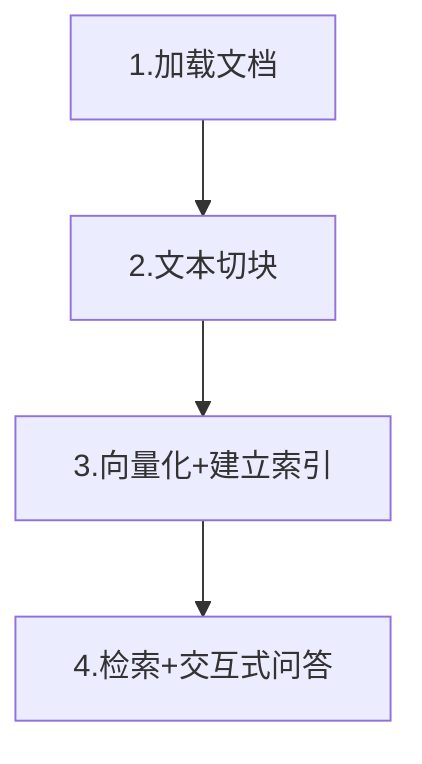
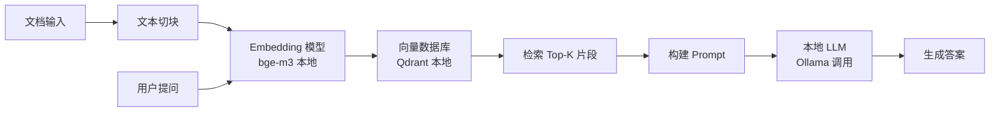

# RAG 学习记录

## 1. 推荐学习路线

  第一步（1天）
  └── 跑通 langchain-ai/langchain 里的
      "RAG over documents" notebook
      → 理解：文档切块 → 向量化 → 检索 → 生成 的全流程

  第二步（2天）
  └── 部署 infiniflow/ragflow 或 Langchain-Chatchat
      → 上传自己的 PDF，亲眼看到效果
      → 感受"没有 RAG"vs"有 RAG"的差异

  第三步（按需）
  └── 用 ragas 跑一次评估
      → 理解 Faithfulness / Relevancy 指标的实际含义


## 2.Demo流程



### 2.1 加载文档

**文档存放路径**

Demo 中文档统一放在 `knowledge_base/` 目录下，路径在脚本顶部配置：

```python
DOCS_DIR = Path(__file__).parent / "knowledge_base"
```

实际项目中路径可以是任意形式：

| 来源类型 | 示例路径/方式 |
|----------|--------------|
| 本地文件夹 | `/data/docs/` 或网络共享盘 |
| 对象存储 | 阿里云 OSS、AWS S3 |
| 数据库 | 从 MySQL/MongoDB 查询后转文本 |
| 实时抓取 | 网页 URL、内部 Wiki、Confluence |

**是否支持动态增删？**

支持，但需要配套更新向量库，有三种策略：

**① 新增文档**
```
上传新文档 → 解析 → 切块 → 向量化 → 追加写入向量库
不需要重建整个索引，只插入新 chunk
```

**② 删除文档**
```
从向量库中按 source 元数据过滤，批量删除该文档的所有 chunk
collection.delete(where={"source": "要删除的文件名"})
```

**③ 更新文档（原文件内容有修改）**
```
先删除旧版本的所有 chunk（按文件名过滤）
再走新增流程重新索引
```

> **注意：** 如果直接覆盖原文件但不更新向量库，向量库里存的还是旧版本内容，
> 会导致检索结果和实际文档不一致——这是生产环境中常见的数据不同步问题。

### 2.2 文本切块

切块涉及到三个问题点：1.切换的原因 。2.为何要重叠区。3.分别的阈值选多少。

#### 2.2.1切块的原因

- 原因 1：Embedding 模型有输入长度上限（通常 512 tokens），长文档必须切块。

- 原因 2：切块后每块语义更集中，检索时能精确定位到相关段落，而不是返回整篇文章。

- 原因 3：LLM 的上下文窗口有限，只能把最相关的 3-5 个片段塞进 Prompt。

#### 2.2.2 重叠的意义

  如果不重叠，关键信息可能恰好落在两个 chunk 的边界，被切断。

  重叠 50 字确保边界附近的内容在两个 chunk 中都出现。

#### 2.2.3 阈值的选取

具体的阈值需要根据实际的测试来决定，可以切块值可以参考：

| 文档类型           | 建议Chunk大小                  |
| ------------------ | ------------------------------ |
| 法律条款、规章制度 | 200-300 字（条款短，语义独立） |
| 产品手册、技术文档 | 400-600 字（段落较长）         |
| 新闻、文章         | 300-500 字                     |
| FAQ 问答对         | 直接以一问一答为单位，不切块   |


### 2.3 向量化+建立索引

#### 2.3.1 什么是向量化（Embedding)

- 把文字转换成一串数字（高维向量），例如：

>    "员工生日福利" → [0.12, -0.34, 0.78, ..., 0.05]  （384个数字）
>
>    "生日当天的假期" → [0.11, -0.31, 0.80, ..., 0.06]  （384个数字）

- 语义相近的文字，对应的向量在数学空间中距离更近。

  这样就能用"计算两个向量的余弦相似度"来找到语义最相关的内容。

#### 2.3.2 为什么用向量数据库而不是普通数据库

- 普通数据库（MySQL）做的是精确匹配，比如 WHERE content LIKE '%生日%'

- 向量数据库做的是语义相似搜索，能找到"表达意思相近"的内容，即使用词完全不同也能匹配到（如"生日" 和 "出生纪念日"）。

#### 2.3.3 向量数据库的索引逻辑

**为什么需要特殊索引？**

普通数据库索引（B-Tree）做的是精确匹配，向量检索做的是**最近邻搜索（ANN）**：

```
在 384 维空间里，找和查询向量距离最近的 Top-K 个点

暴力做法：把查询向量和库里每一个向量逐个计算距离
问题：库里有 100 万个向量 → 要算 100 万次 → 太慢
```

**ChromaDB 默认使用 HNSW 算法**

全称：Hierarchical Navigable Small World（分层可导航小世界）

核心思想类比"人脉网络找人"：不会挨个联系所有人，而是先问认识的大人物（高层节点），再逐层缩小范围，最终精确定位。

```
第 2 层（稀疏）  •————————•————•     少数枢纽节点，跨度大，快速缩小范围
第 1 层（中等）  •——•————•——•——•     中等密度，进一步导航
第 0 层（完整）  •—•—•—•—•—•—•—•     所有节点，最终精确搜索
```

**两个关键参数：**

| 参数 | 含义 | 值越大 |
|------|------|--------|
| `M` | 每个节点最多连接几个邻居 | 精度↑，内存↑，构建慢 |
| `ef` | 搜索时维护的候选集大小 | 精度↑，查询慢 |

默认值对大多数场景够用，无需手动调整。

**ANN 的本质取舍：**

```
精确最近邻（Exact）→ 结果 100% 准确，但慢 O(n)
近似最近邻（ANN） → 结果 95%+ 准确，但快 O(log n)
```

HNSW 属于 ANN，牺牲极小的精度换取极大的速度提升。实际 RAG 场景中这 5% 的误差影响可以忽略，因为第 3 名和第 4 名的检索结果差异本身就很小。

#### 2.3.4 向量化工具对比

核心差异在三个维度：**中文支持、是否需要 GPU、部署方式**。

| 工具 | 代表模型 | 中文效果 | 部署方式 | 适用场景 |
|------|----------|----------|----------|----------|
| sentence-transformers | paraphrase-multilingual-MiniLM-L12-v2 | 良好 | 本地，需 PyTorch | 中小规模，追求质量 |
| ChromaDB 内置 | all-MiniLM-L6-v2 | 一般（英文优化） | 本地，基于 onnxruntime | 快速起步，无需 GPU |
| BGE 系列（BAAI） | bge-m3 / bge-large-zh | 优秀 | 本地，需 PyTorch | 中文为主的生产环境 |
| OpenAI API | text-embedding-3-large | 优秀 | 云端 API | 不想维护模型，预算充足 |
| 阿里云 / 通义 | text-embedding-v3 | 优秀 | 云端 API | 国内合规，数据不出境需求低 |

**选型建议：**

```
学习阶段      → ChromaDB 内置（零配置）
中文生产环境  → BGE-M3（本地）或 通义 Embedding API（云端）
数据不能出境  → BGE-M3 本地部署
预算优先      → text-embedding-3-small（OpenAI 最便宜档）
```

#### 2.3.5 向量数据库的对比

核心差异在：**规模、部署复杂度、生态成熟度**。

| 数据库 | 定位 | 最大规模 | 部署复杂度 | 亮点 |
|--------|------|----------|------------|------|
| ChromaDB | 轻量本地 | 百万级 | 极低（纯 Python） | 零配置，适合开发调试 |
| Qdrant | 生产级 | 亿级 | 低（单二进制文件） | 支持复杂过滤，Rust 实现性能好 |
| Milvus | 企业级 | 百亿级 | 高（依赖 K8s） | 国产，功能最全，社区活跃 |
| Weaviate | 生产级 | 亿级 | 中 | 支持多模态，GraphQL 接口 |
| pgvector | 扩展型 | 千万级 | 低（PostgreSQL 插件） | 已有 PG 环境直接用，无需新增组件 |
| Pinecone | 托管云服务 | 无限 | 极低（无需运维） | 全托管，按用量计费 |

**选型建议：**

```
Demo / 学习                → ChromaDB
生产，数据 < 1000万 chunk  → Qdrant 或 pgvector（已有PG时）
生产，数据 > 1000万 chunk  → Milvus
不想运维                   → Pinecone（国外）/ Zilliz Cloud（Milvus 托管版，国内）
```

### 2.4 检索+交互式回答

#### 2.4.1 检索的匹配逻辑及阈值的选定逻辑

检索本质是计算用户问题向量和每个 chunk 向量之间的**余弦相似度**：

```
相似度 = cos(θ) = (A·B) / (|A| × |B|)

结果范围 0~1：
  1.0  → 方向完全一致，语义几乎相同
  0.8+ → 高度相关
  0.6  → 有一定相关性
  0~0.5 → 基本不相关
```

**阈值的选定逻辑**

阈值有两个层面：

**① Top-K（返回几个片段）**

不是靠相似度过滤，而是直接取最相似的前 K 个：

```
K 太小（如1）→ 可能漏掉关键信息（答案跨多个 chunk）
K 太大（如10）→ 噪音片段增多，干扰 LLM 生成，且占用更多 context
推荐起点：K = 3~5
```

**② 相似度阈值过滤（Score Threshold）**

在 Top-K 基础上，增加一道"最低分数线"，低于阈值的片段直接丢弃：

```
阈值过低（如 0.3）→ 不相关内容混入，LLM 容易产生幻觉
阈值过高（如 0.9）→ 可能一个片段都找不到，系统无法回答
推荐起点：0.6~0.7
```

**怎么定这两个值？**

同样需要实验，没有通用答案：

```
准备测试集（20~30 个问题 + 标准答案）
逐步调整 K 和阈值，记录：
  - 命中率（答案是否在返回的片段里）
  - 噪音率（返回片段中无关内容占比）
找到命中率高、噪音率低的最优组合
```

> **实际现象：** 阈值设 0.5 以上时，当知识库里确实没有答案，所有片段相似度都会低于阈值，
> 系统就能判断"不知道"，而不是乱猜——这是控制幻觉的重要手段之一。

#### 2.4.2 构建 Prompt + 调用 LLM 生成答案

RAG 的核心：把检索到的原文片段 + 用户问题组合成发给 LLM 的完整指令。

**Prompt 的结构组成**

RAG 的 Prompt 通常由三部分拼接而成：

```
┌─────────────────────────────────────┐
│ 1. 系统指令（System Prompt）         │  告诉 LLM 它的角色和行为规则
│    - 只能基于知识库内容回答           │
│    - 不知道就说不知道，不要编造        │
├─────────────────────────────────────┤
│ 2. 检索到的上下文（Context）          │  检索阶段找到的 Top-K 个原文片段
│    【来源：xx文档】原文内容...         │
│    【来源：xx文档】原文内容...         │
├─────────────────────────────────────┤
│ 3. 用户问题（Query）                  │  本次提问
└─────────────────────────────────────┘
```

**两条关键指令不能少**

```
① "只根据以上内容回答" → 限制 LLM 不使用训练数据里的知识，防止幻觉
② "不知道就说不知道"   → 当检索片段无关时，给 LLM 一个明确的退路
```

没有这两条，LLM 会用自己的训练知识"补全"答案，导致回答看起来合理但实际没有依据。

**Context 长度的取舍**

```
片段太少 → 信息不够，LLM 无法完整回答
片段太多 → 占用大量 context 窗口，推理变慢，且 LLM 注意力分散（Lost in the Middle 问题）

实践规律：把最相关的内容放在 Prompt 的开头或结尾，
         LLM 对中间位置的内容注意力最弱
```

**引用来源的重要性**

让 LLM 在回答中标注信息来自哪份文档、哪个段落，有两个作用：
- 用户可以验证答案是否可信
- 出现错误时能快速定位是检索问题还是生成问题


## 3. 当前的服务器配置

**连接方式：** `ssh jjh@192.168.1.140`

### 3.1 硬件配置

| 项目 | 规格 |
|------|------|
| **机器型号** | NVIDIA DGX Spark（Version 7.5.0） |
| **架构** | aarch64（ARM 64位） |
| **操作系统** | Ubuntu 24.04.4 LTS（Noble Numbat） |
| **内核** | Linux 6.17.0-1014-nvidia |
| **CPU** | ARM big.LITTLE 异构架构，共 20 核 |
| ↳ 性能核 | Cortex-X925 × 10，最高 3900 MHz |
| ↳ 能效核 | Cortex-A725 × 10，最高 2808 MHz |
| **L2 缓存** | 25 MiB × 20（每核独立） |
| **L3 缓存** | 24 MiB × 2 |
| **内存** | **121 GB** RAM（统一内存，CPU 与 GPU 共享） |
| **Swap** | 15 GB |
| **存储** | 3.7 TB NVMe SSD（当前仅用 2%，剩余 3.5 TB） |
| **GPU** | NVIDIA GB10（Grace Blackwell 集成） |
| ↳ 驱动版本 | 580.126.09 |
| ↳ CUDA 版本 | 13.0 |
| ↳ 显存 | **统一内存**（无独立显存，GPU 直接使用全部 121 GB 系统内存） |
| ↳ 当前温度 | 39°C |

> **关键特性 —— 统一内存架构（Unified Memory）**
>
> GB10 芯片采用 Grace Blackwell 设计，CPU 与 GPU 共享同一块内存池，没有独立显存。
> 这意味着 GPU 可以直接访问 **全部 121 GB 内存**作为"显存"使用，
> 彻底消除了传统架构中 CPU↔GPU 的数据搬运瓶颈。
> 对本地大模型推理极为友好——相当于拥有一张"121 GB 显存"的显卡。

---

### 3.2 软件环境

| 软件 | 版本/状态 |
|------|-----------|
| **Python** | 3.12.3（`/usr/bin/python3`） |
| **CUDA Toolkit** | 13.0（随驱动） |
| **Ollama** | 已安装（`/usr/local/bin/ollama`） |
| ↳ 已下载模型 | `gemma4:latest`（9.6 GB） |

**虚拟环境路径：** `/home/jjh/works/RAG_Projects/demo/.venv/`

| Python 包 | 版本 | 用途 |
|-----------|------|------|
| `torch` | 2.11.0 | 深度学习基础库（GPU 加速 Embedding） |
| `sentence-transformers` | 5.4.1 | 加载 bge-m3 等 Embedding 模型 |
| `chromadb` | 1.5.8 | 本地向量数据库 |
| `transformers` | 5.5.4 | HuggingFace 模型加载 |
| `huggingface_hub` | 1.11.0 | 模型下载管理 |
| `ollama`（Python客户端） | 0.6.1 | 调用本地 Ollama LLM |
| `tokenizers` | 0.22.2 | 高性能分词器 |

---

## 4. 推荐的 RAG 方案

> 目标：**完全本地运行**，不依赖任何云端 API，所有计算在 DGX Spark 上完成。

### 4.1 方案总览



### 4.2 各组件选型

#### LLM（生成模型）

**选定：`qwen3.6:35b-a3b-q4_K_M`（通过 Ollama 本地运行）**

| 项目 | 说明 |
|------|------|
| **模型架构** | Qwen3.6 MoE（混合专家），35B 总参数，每次推理仅激活 ~3B |
| **量化格式** | Q4_K_M（标准 GGUF 量化），兼容 Linux + NVIDIA GPU |
| **实际大小** | 24 GB |
| **上下文窗口** | 256K tokens |
| **为什么选它** | MoE 架构推理速度接近 3B 模型，但效果接近 35B；Q4_K_M 是最成熟的通用量化格式 |
| **内存占用** | 24 GB，121 GB 统一内存绰绰有余 |

> ⚠️ **注意：** `nvfp4` 是 macOS 专用格式（Apple Neural Engine），在 Linux 上无法运行。

> **当前状态：** Ollama 中尚未下载，需执行以下命令拉取：

```bash
ollama pull qwen3.6:35b-a3b-q4_K_M
```

> 同系列可选量化版本（均兼容 Linux/NVIDIA）：
> | Tag | 大小 | 说明 |
> |-----|------|------|
> | `qwen3.6:35b-a3b-q4_K_M` | 24 GB | **推荐**，速度与质量的最佳平衡 |
> | `qwen3.6:35b-a3b-q8_0` | 39 GB | 精度更高，内存充足时可选 |
> | `qwen3.6:35b-a3b-bf16` | 71 GB | 全精度，121 GB 内存装得下 |
> | `qwen3.6:35b-a3b-nvfp4` | 22 GB | ❌ macOS 专用，Linux 不可用 |
> | `gemma4`（已有） | 9.6 GB | 英文为主，可作备用 |

---

#### Embedding 模型

**推荐：BGE-M3（中文最优选择）**

> venv 已安装 `sentence-transformers 5.4.1` 和 `torch 2.11.0`，**无需重装任何库**。
> BGE-M3 是一个**模型文件**（约 2.3 GB），需要单独从 HuggingFace 下载：

```bash
# 激活 venv
source /home/jjh/works/RAG_Projects/demo/.venv/bin/activate

# 设置国内镜像加速（可选，下载更快）
export HF_ENDPOINT=https://hf-mirror.com

# 下载 BGE-M3 模型文件到本地缓存（~/.cache/huggingface/）
python -c "from sentence_transformers import SentenceTransformer; SentenceTransformer('BAAI/bge-m3')"
```

> 下载完成后模型缓存在 `~/.cache/huggingface/hub/`，后续离线可直接使用。

| 模型 | 大小 | 中文效果 | 说明 |
|------|------|----------|------|
| `BAAI/bge-m3` | 2.3 GB | ★★★★★ | 支持中英文，最推荐 |
| `BAAI/bge-large-zh-v1.5` | 1.3 GB | ★★★★☆ | 纯中文，速度更快 |
| ChromaDB 内置 | ~90 MB | ★★★☆☆ | 零配置，英文优化，学习阶段用 |

---

#### 向量数据库

**开发阶段：ChromaDB**（零配置，当前 Demo 已在用）

**生产阶段：Qdrant**（单二进制，性能好，支持复杂过滤）

```bash
# 安装 Qdrant（Docker 方式，最简单）
docker run -p 6333:6333 -v $(pwd)/qdrant_storage:/qdrant/storage qdrant/qdrant

# 或者纯 Python 客户端（内存模式，无需 Docker）
pip install qdrant-client
```

| 数据库 | 推荐场景 | 理由 |
|--------|----------|------|
| **ChromaDB** | Demo、学习、< 10万 chunk | 零配置，已集成在 Demo 里 |
| **Qdrant** | 生产、> 10万 chunk | 单二进制部署，Rust 实现性能优秀 |
| **Milvus** | 超大规模、> 1000万 chunk | 功能最全，但部署复杂 |

---

### 4.3 推荐的分阶段落地路径

> **模型始终不变：Qwen3.6-35B-A3B**
> 阶段切换时只换推理引擎（Ollama → vLLM），不换模型。
> Ollama 加载 GGUF/q4_K_M 格式；vLLM 加载 HuggingFace FP8 格式（Blackwell 原生加速，精度更高）。

```
阶段一：功能验证 + 网页体验
├── 推理引擎：Ollama（无需 Docker，快速启动）
├── Embedding：bge-m3
├── 向量库：ChromaDB
└── 网页界面：Streamlit（局域网内所有人可通过浏览器体验）

阶段二：Advanced RAG + 生产化
├── 推理引擎：vLLM Docker（支持批量评估 + 高并发服务）
├── Embedding：bge-m3 + BM25 混合检索
├── Reranker：bge-reranker-v2-m3（二次精排）
├── 向量库：Qdrant（支持元数据过滤）
└── 框架：LangChain 或 LlamaIndex 串联全流程
```

**何时从阶段一切换到阶段二：**
- RAG 管道逻辑跑通，收集到用户反馈
- 需要跑 RAGAS 批量评估，或多人同时使用出现卡顿
- 切换只需将调用地址从 Ollama 改为 `http://localhost:8000/v1`（vLLM 兼容 OpenAI API）

---

### 4.5 阶段一：Streamlit 网页界面

**安装：**
```bash
source /home/jjh/works/RAG_Projects/demo/.venv/bin/activate
pip install streamlit
```

**核心结构（`demo/app.py`）：**
```python
import sys
from pathlib import Path
import streamlit as st

# 复用 rag_demo.py 的全部函数，不重复写逻辑
sys.path.insert(0, str(Path(__file__).parent))
from rag_demo import (
    DOCS_DIR, CHROMA_DIR, EMBEDDING_MODEL, TOP_K,
    load_documents, chunk_documents, build_index,
    retrieve, build_rag_prompt, call_llm,
)

st.set_page_config(page_title="RAG 知识库问答", layout="wide")
st.title("📚 RAG 知识库问答演示")

# 启动时构建索引（@cache_resource 保证只执行一次，不会每次提问都重建）
@st.cache_resource(show_spinner="正在构建知识库索引，请稍候...")
def init_index():
    docs = load_documents(DOCS_DIR)
    chunks = chunk_documents(docs, 300, 50)
    embed_model, collection = build_index(chunks, CHROMA_DIR, EMBEDDING_MODEL)
    return embed_model, collection

embed_model, collection = init_index()

# 问答界面
query = st.chat_input("请输入你的问题...")

if query:
    col1, col2 = st.columns([1, 2])

    with col1:
        st.subheader("🔍 检索到的片段")
        results = retrieve(query, embed_model, collection, TOP_K)
        for i, r in enumerate(results):
            with st.expander(f"片段 {i+1}（相似度: {r['similarity']:.3f}）"):
                st.write(r["text"])
                st.caption(f"来源：{r['source']}")

    with col2:
        st.subheader("💬 回答")
        prompt = build_rag_prompt(query, results)
        with st.spinner("生成中..."):
            answer = call_llm(prompt)
        if answer:
            st.markdown(answer)
        else:
            st.info('当前 LLM_BACKEND = "none"，请修改 rag_demo.py 顶部配置以启用 LLM。')
```

**启动（局域网所有人可访问）：**
```bash
streamlit run demo/app.py --server.address 0.0.0.0 --server.port 8501
# 访问地址：http://192.168.1.140:8501
```

**Streamlit 的优势（对比 Gradio）：**
- 左右分栏同时展示"检索片段 + 相似度分数"和"LLM 回答"，直观演示 RAG 原理
- 支持流式输出（`st.write_stream`）
- 代码即界面，调试时改代码刷新页面即可看到变化

### 4.4 最小可运行配置（立即可做）

```bash
# 1. 拉取目标 LLM 模型（约 20 GB，3.5TB 磁盘足够）
ollama pull qwen3.6:35b-a3b-q4_K_M

# 2. 激活已有 venv（torch、sentence-transformers、chromadb 已全部就绪，无需重装）
source /home/jjh/works/RAG_Projects/demo/.venv/bin/activate

# 3. 首次需下载 BGE-M3 模型文件（约 2.3 GB，下载后缓存到本地，后续无需重下）
export HF_ENDPOINT=https://hf-mirror.com   # 国内镜像加速
python -c "from sentence_transformers import SentenceTransformer; SentenceTransformer('BAAI/bge-m3')"

# 4. 修改 demo/rag_demo.py 顶部配置
# EMBEDDING_BACKEND = "sentence"   # 使用 sentence-transformers + bge-m3
# LLM_BACKEND       = "ollama"
# OLLAMA_MODEL      = "qwen3.6:35b-a3b-q4_K_M"
# 注意：qwen3 支持 thinking 模式，若响应慢请加 think=False
```

> **venv 已包含所有必要依赖**（torch、sentence-transformers、chromadb、ollama），
> 拉完模型后直接运行 Demo 即可，无需额外安装。

---

## 5. Advanced RAG 进阶技术

> 当前 Demo 是"朴素 RAG"（Naive RAG）。以下技术是从 Demo 迈向生产级的核心升级点，
> 按**性价比从高到低**排序，建议依次落地。

### 5.1 重排序（Re-ranking）⭐ 优先级最高

**原理：** 先用向量检索快速召回 Top-50 候选片段，再用专门的 Reranker 模型对这 50 个片段做精细打分，取最终 Top-5 送入 LLM。

```
向量检索（快，召回率高）→ Top-50 → Reranker（慢但精准）→ Top-5 → LLM
```

**为什么性价比最高：** 实现只需加一个模型调用，准确率通常从 70% 提升到 85% 以上。

**推荐模型：** `BAAI/bge-reranker-v2-m3`（中英文双语，约 1.1 GB）

```python
from sentence_transformers import CrossEncoder

reranker = CrossEncoder('BAAI/bge-reranker-v2-m3')

# 召回阶段：向量检索 Top-50
candidates = vector_db.query(query, top_k=50)

# 精排阶段：Reranker 打分，取 Top-5
pairs = [(query, doc.text) for doc in candidates]
scores = reranker.predict(pairs)
top5 = sorted(zip(scores, candidates), reverse=True)[:5]
```

---

### 5.2 混合检索（Hybrid Search）

**原理：** 同时执行"向量检索（语义相似）"和"BM25 检索（关键词精确匹配）"，再合并结果（RRF 算法融合排名）。

**为什么需要：** 纯向量检索在处理产品型号（如"GB10"）、人名、缩写等精确词时经常失效，而 BM25 对这类精确匹配效果极好。两者互补。

```
用户问题
  ├── 向量检索 → 语义相关的 Top-K
  └── BM25 检索 → 关键词精确匹配的 Top-K
        ↓
    RRF 融合排名 → 综合 Top-K → （可选）Reranker → LLM
```

**Qdrant 原生支持混合检索**，是升级向量库的主要理由之一。

---

### 5.3 查询转换（Query Transformation）

#### Query Rewrite（查询改写）
将用户简短模糊的提问改写为更利于检索的完整描述。

> ⚠️ **注意事项：** 每次多一次 LLM 调用，增加约 1-2 秒延迟。建议仅在多轮对话或问题明显模糊时启用，不要默认对所有问题开启。

#### HyDE（假设文档嵌入）
先让 LLM 生成一个"伪答案"，再用伪答案去检索知识库（而不是用原始问题检索）。

> ⚠️ **注意事项：** 效果不稳定——当 LLM 生成的伪答案方向偏了，检索结果反而比直接用原问题更差。适合作为了解性技术，**不建议作为默认方案**，需要 A/B 测试验证。

---

### 5.4 文档解析进阶（复杂 PDF / 表格）

**生产环境最大的隐患：** PDF 中的表格被切断后语义全失，纯文本提取完全无法处理。

**推荐工具：Docling**（IBM 开源，2024 年发布，当前最佳选择）

```bash
pip install docling

# 解析 PDF，保留表格结构
from docling.document_converter import DocumentConverter
converter = DocumentConverter()
result = converter.convert("your_document.pdf")
markdown_text = result.document.export_to_markdown()  # 表格转为 Markdown 格式保留结构
```

**与 Unstructured 的区别：** Docling 对表格、公式、多栏布局的解析质量更好，且对中文支持更友好。

> 前沿方向（暂不需要实践）：**多模态 RAG** —— 让 LLM 直接"看"文档中的图片和图表，
> 当前工程链路尚不成熟，待 Vision 模型能力稳定后再考虑引入。

---

### 5.5 元数据过滤（Metadata Filtering）

**原理：** 切块时为每个 chunk 附加元数据标签（来源文件、部门、时间、文件类型等），检索时先按标签过滤，再做向量搜索，避免全库盲搜。

```python
# 切块时存入元数据
chunk = {
    "text": "...",
    "metadata": {
        "source": "产品手册_v2.pdf",
        "department": "研发部",
        "date": "2026-01",
        "doc_type": "manual"
    }
}

# 检索时按条件过滤（Qdrant 示例）
results = qdrant.search(
    query_vector=embed(query),
    query_filter={"department": "研发部", "doc_type": "manual"},
    limit=10
)
```

**实用价值：** 多部门共用同一知识库时，可通过权限标签隔离各部门数据。

---

### 5.6 评估与闭环（Evaluation）

#### RAG 三元组评估指标

| 指标 | 评估内容 | 对应问题 |
|------|---------|---------|
| **Context Relevance** | 检索到的片段是否与问题相关 | 检索准不准？ |
| **Groundedness** | 生成的答案是否来自原文，有无幻觉 | 有没有编造？ |
| **Answer Relevance** | 答案是否真正回答了用户问题 | 答没答到点上？ |

**推荐工具：RAGAS**（文档第 1 章已提及，此处深化）

```bash
pip install ragas

# 用 LLM 自动生成黄金测试集（问题-答案-原文 三元组）
from ragas.testset import TestsetGenerator
generator = TestsetGenerator.from_langchain(llm, embeddings)
testset = generator.generate_with_langchain_docs(docs, test_size=30)

# 评估 RAG 流水线
from ragas import evaluate
from ragas.metrics import context_relevancy, faithfulness, answer_relevancy
results = evaluate(dataset, metrics=[context_relevancy, faithfulness, answer_relevancy])
```

> **黄金数据集建设：** 利用 LLM 从知识库文档中自动生成"问题-答案-原文"三元组，
> 建立 20~30 条测试集，每次优化后跑一遍评估，形成量化的改进闭环。

---

### 5.7 工程化与体验

#### 流式输出（Streaming）
对用户体验影响极大，Ollama 和 vLLM 均原生支持，几乎零成本。

```python
# Ollama 流式输出
import ollama
for chunk in ollama.chat(model='qwen3.6:35b-a3b-q4_K_M',
                          messages=[{'role': 'user', 'content': prompt}],
                          stream=True):
    print(chunk['message']['content'], end='', flush=True)
```

#### 引用跳转（Citation Jump）
在回答中标注信息来源，点击可定位到原始文档位置。

> **实现前提：** 切块时必须把页码、段落位置存入元数据；前端需要配合开发跳转逻辑。
> 对用户信任度提升显著，但实现复杂度较高，建议在基础 RAG 稳定后作为进阶目标。

#### 语义缓存（Semantic Cache）
对相似的高频问题直接返回缓存答案，降低推理开销。

> 本地部署场景下推理本身已无 API 费用，优先级较低。如有需要，建议用 **Redis + 向量相似度**实现，而非 GPTCache（该项目维护活跃度下降）。

---

## 6. 生产化部署：vLLM vs Ollama

### 6.1 核心差异对比

| 维度 | Ollama（面向开发者） | vLLM（面向生产/高并发） |
|------|-------------------|----------------------|
| **设计哲学** | 易用性优先，一键运行 | 性能与吞吐量优先，压榨每一分 GPU 带宽 |
| **内存管理** | 相对简单，显存满后速度断崖下跌 | **PagedAttention**：像虚拟内存一样管理显存，零浪费 |
| **并发处理** | 请求串行排队，1人快 10人卡 | **Continuous Batching**：可同时处理几十个并发请求 |
| **多卡支持** | 较弱 | 原生支持张量并行，轻松横跨多卡 |
| **适用场景** | 个人调试、快速验证、单用户 | **RAG 后端、高并发 API、团队共用服务** |
| **吞吐量对比** | 基准 1x | 通常高 3~5 倍 |

**选用原则：**
- 个人测试 / 验证模型效果 → **Ollama**
- 搭建正式 RAG 服务供团队使用 → **vLLM**

---

### 6.2 为什么在 DGX Spark 上推荐 Docker 部署 vLLM

1. **依赖链极其复杂**：vLLM 深度集成特定版本 CUDA、PyTorch C++ 算子、Blackwell 专用内核，直接 `pip install` 极易因版本冲突导致环境损坏。Docker 提供预配置好的"无尘车间"。

2. **Blackwell 首发优化已打包**：官方镜像内置了针对 GB10 优化的 **FlashAttention-3** 和 **FP8 加速内核**，自行编译需要数天调试时间。

3. **环境隔离**：DGX Spark 系统环境为稳定性设计，Docker 保证 RAG 工具与宿主机解耦，容器损坏直接删除重建，不影响原有开发环境。

> **前置条件（已满足）：**
> - Docker 29.2.1 ✅
> - NVIDIA Container Toolkit 1.19.0 ✅

---

### 6.3 在 DGX Spark 上部署 vLLM

> ⚠️ **架构注意：** 服务器为 `aarch64`，必须使用 `latest-aarch64` 标签，
> `latest` 是 x86_64 版本，在本机无法运行。

```bash
# 使用 Qwen3.6-35B-A3B FP8 版本（HuggingFace 官方量化，专为 Blackwell FP8 加速设计）
docker run --gpus all \
    -v ~/.cache/huggingface:/root/.cache/huggingface \
    -p 8000:8000 \
    --ipc=host \
    vllm/vllm-openai:latest-aarch64 \
    --model Qwen/Qwen3.6-35B-A3B-FP8 \
    --max-model-len 32768 \
    --gpu-memory-utilization 0.95
```

**参数说明：**

| 参数 | 说明 |
|------|------|
| `--gpus all` | 将 GB10 GPU 透传给容器 |
| `-v ~/.cache/huggingface:...` | 模型文件挂载到容器，避免重复下载 |
| `--ipc=host` | 共享宿主机内存，提升大模型加载速度 |
| `--model Qwen/Qwen3.6-35B-A3B-FP8` | FP8 量化版，Blackwell 原生支持，比 Q4_K_M 精度更高 |
| `--max-model-len 32768` | 限制上下文长度（模型支持 256K，此处保守设置保稳定性） |
| `--gpu-memory-utilization 0.95` | 使用 95% 的统一内存池（GB10 统一内存 = CPU+GPU 共享 121 GB） |

**RAG 逻辑代码统一写法（Ollama 和 vLLM 通用）：**

Ollama 和 vLLM 都支持 OpenAI 兼容接口，RAG 代码只写一份，切换推理引擎时只改配置区的一个地址：

```python
# rag_demo.py 顶部配置区 —— 只改这一行来切换推理引擎
LLM_BASE_URL = "http://localhost:11434/v1"  # 阶段一：Ollama
# LLM_BASE_URL = "http://localhost:8000/v1"  # 阶段二：vLLM（切换时取消注释）

# ----------------------------------------------------------
# 以下调用逻辑两个阶段完全相同，永远不需要改
from openai import OpenAI

client = OpenAI(base_url=LLM_BASE_URL, api_key="none")

response = client.chat.completions.create(
    model="qwen3.6",
    messages=[{"role": "user", "content": prompt}],
    stream=True
)
```
